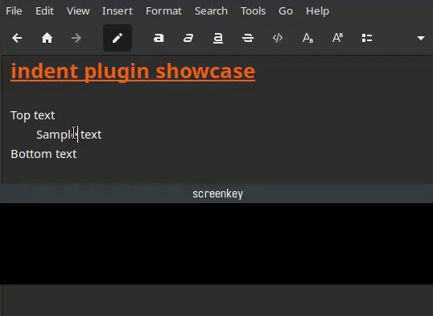
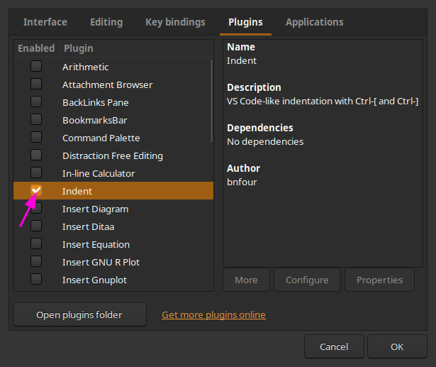

# Zim plugin for indentation
This plugin adds VS Code-like text indentation and outdentation with `Ctrl-]` and `Ctrl-[` hotkeys respectively (by default).

## Installation
The plugin itself is distributed as a single Python file.

### Requirements
Zim installed. Python 3.12+ for [type aliases](https://docs.python.org/3/library/typing.html#type-aliases). For older versions, you could try to remove all references to `Action` in the code.

### The process
Just drop `indent.py` into your plugins folder, `~/.local/share/zim/plugins` by default. After that, enable it in the plugins menu (Edit → Preferences (Ctrl+,) → Plugins):

To uninstall, remove the file from the plugin folder. The plugin can also be disabled without removal.

## Configuration
The hotkeys can be changed via Key bindings menu (Edit → Preferences (Ctrl+,) → Key bindings) while the plugin is enabled; look for the following actions:
- `<Actions>/BnIndentExtension/indent` — `Ctrl-]` by default
- `<Actions>/BnIndentExtension/outdent` — `Ctrl-[` by default
